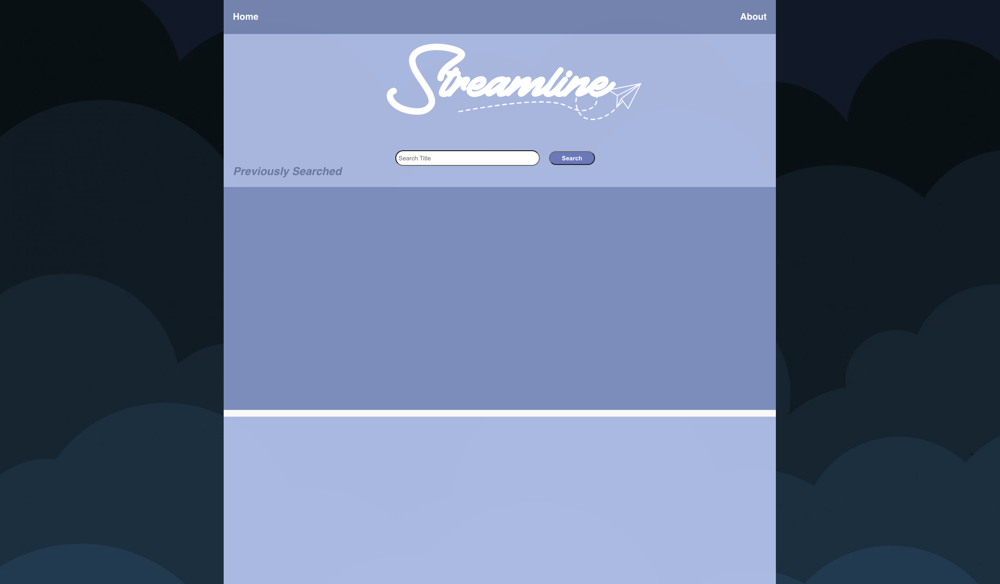
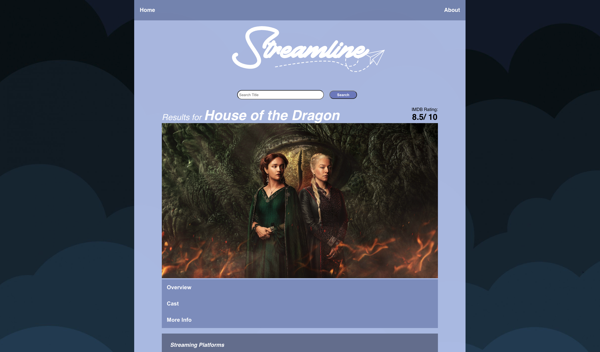
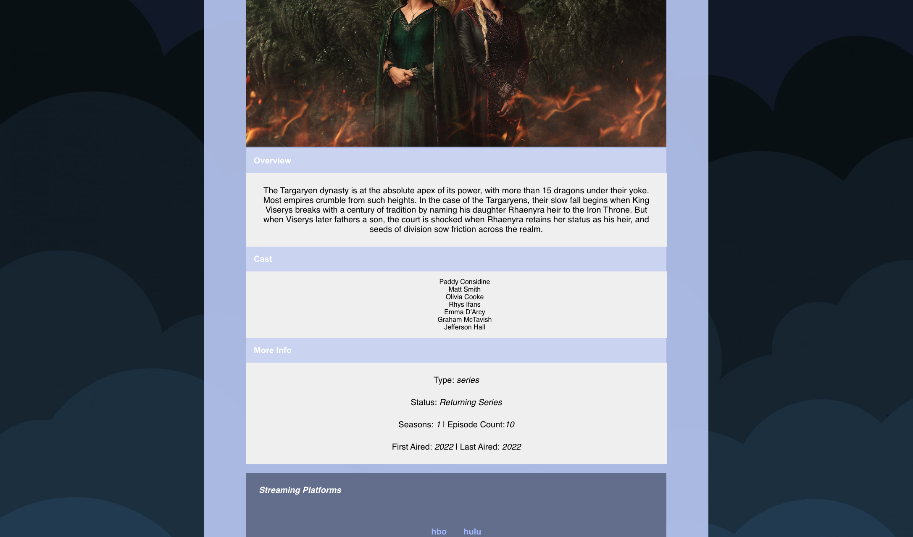
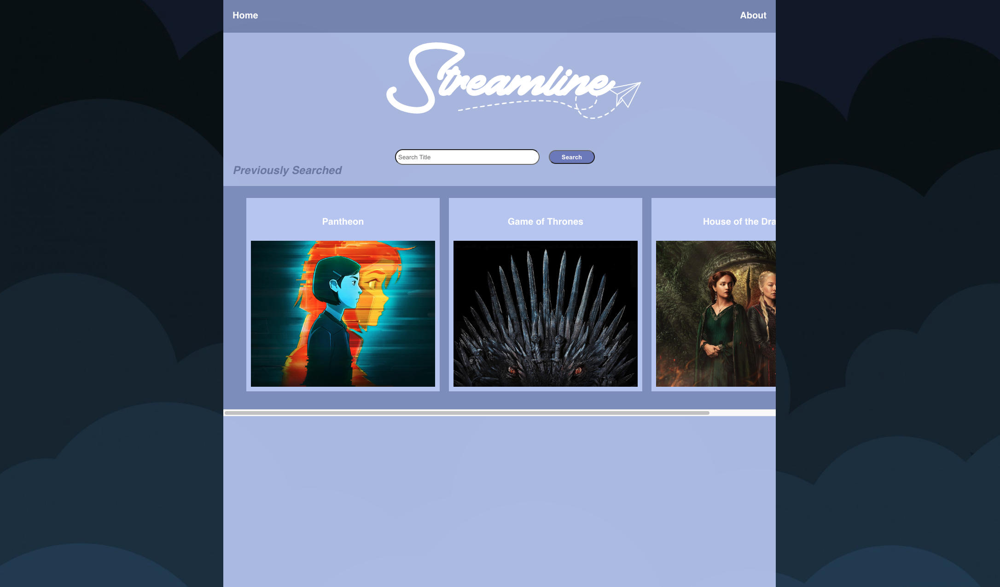
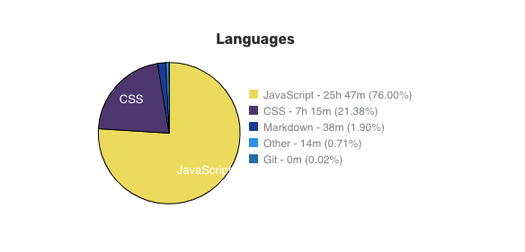

# Streamline Stream Search #

## In App Screen Shots

## Description

#### <i>Streamline Stream Search</i> is a platform is intended to be used to search movies and shows for the streaming services they're available on. Additionally, Streamline offers overviews, IMdb ratings, the cast, and additional information (Status / Air date / Last Aired / Seasons / Episodes).

## Technologies Used

#### <i>Streamline</i> is a primarily built using Javascript, React as the framework and CSS Styling.
For the most accurate update on technologies used, click the waka link above!

### Featured:
  -  JavaScript
  -  React
  -  CSS

## Getting Started / Installation Instructions

- ### 🍴 via Fork:
  (This will run locally on your machine)
  - Click Fork
  - Open file in your <i>Downloads</i> folder and extract the file
  - Open via VSCode
  - Open integrated terminal
  - `npm install`
  - Run `npm start` to run server

- ### 🌐 via Website:
  (This will run via the web based site)
  - <a href="https://streamlinestreamsearch.netlify.app">Click Here</a>

## Contribution Guidelines
  Feedback / Questions / Bugs / Proposed Improvement - all is welcome!

  [Send Me an E-mail!](mailto:mariesa.oconnell@gmail.com)
