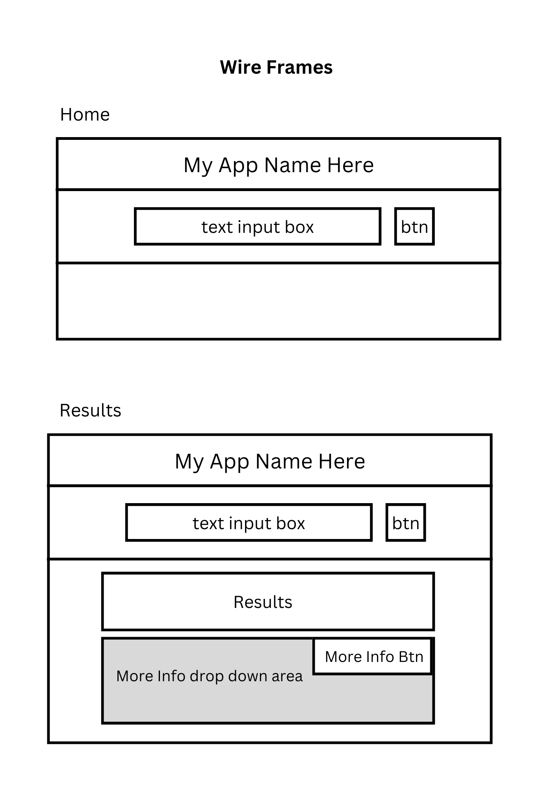

# Project 2: Search Shows / Movies and find the platform they're available on

Wire Frames:

## App.js

App will contain:

- Navigation - Home / About
- Form Component
- <b>STRETCH GOAL:</b> Recently Searched Component

## Form.js

Form will contain:

- input field
- submit button

- searched string value will be passed into the Results Component

## Results

Results will contain:

- Results from search
  - <b>If Success:</b>
    - Will render show name / image / and where it's available
    - Will also render a more info component
  - <b>If Failed:</b>
    - Will tell user the title was not found / no results

## MoreInfo.js

MoreInfo will contain:

- description of the show
- lead actors
- show rating
- number of seasons

## Stretch Goal Component: Recently Searched

I would like to implement a carousel like horizontal scroller that lists recent searches

Will Contain:
  - Image of show
  - name
  - upon click will show streaming platforms & more info that will direct user to results page
